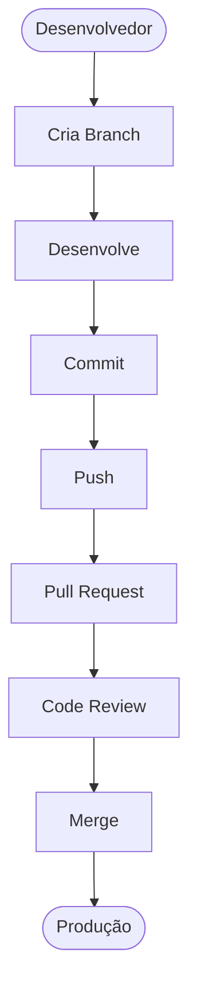
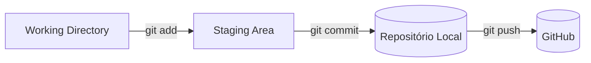
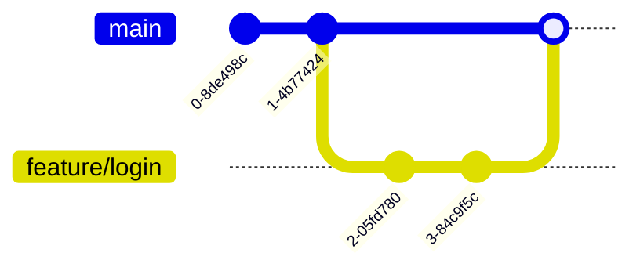
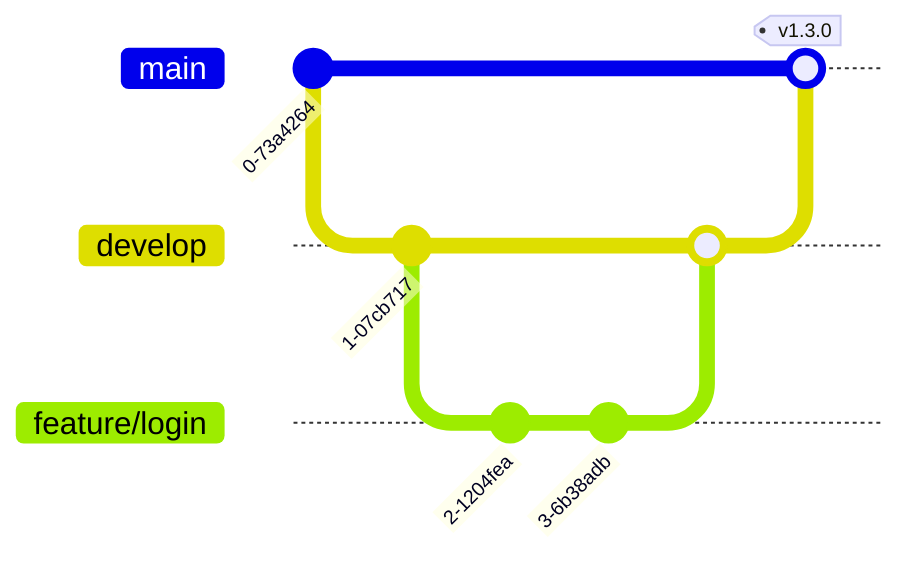
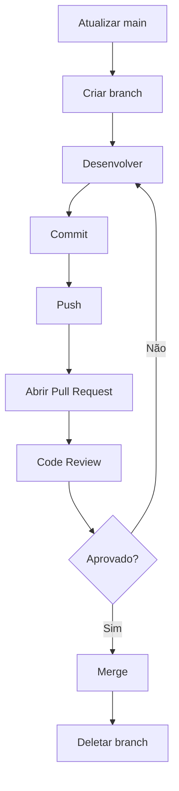
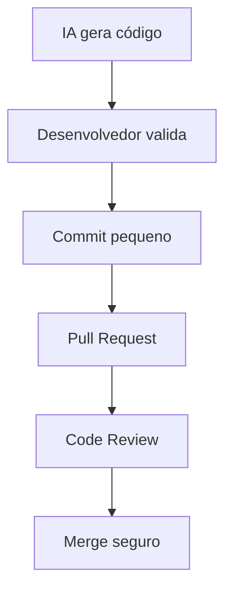

<h1 align="center">🚀 Treinamento Prático: Git + GitHub</h1>

<p align="center"><strong>para Times de Desenvolvimento</strong></p>

<p align="center">
  
  
  
</p>

<p align="center">
  <em>"Amadores escrevem código. Profissionais versionam código."</em>
</p>

---

## 🎯 Objetivo

Ao final deste treinamento, todos os participantes serão capazes de:

* Entender a diferença entre Git e GitHub
* Criar e versionar projetos localmente
* Trabalhar com Branches
* Realizar Commits de forma profissional
* Ignorar arquivos com `.gitignore`
* Sincronizar código com GitHub
* Criar Pull Requests (PR)
* Fazer Code Review
* Resolver conflitos simples
* Entender como Git e GitHub potencializam o uso de IA no desenvolvimento moderno

---

## 📑 Sumário

| # | Tópico | # | Tópico |
| --- | --- | --- | --- |
| [1](#1-o-que-é-git) | O que é Git | [16](#16-push) | Push |
| [2](#2-o-que-é-github) | O que é GitHub | [17](#17-clone) | Clone |
| [3](#3-diferença-entre-git-vs-github) | Git vs GitHub | [18](#18-pull) | Pull |
| [4](#4-fluxo-profissional-de-trabalho) | Fluxo de trabalho | [19](#19-fetch) | Fetch |
| [5](#5-instalando-o-git) | Instalando o Git | [20](#20-fluxo-profissional-de-branches) | Fluxo de branches |
| [6](#6-primeiros-passos) | Primeiros passos | [21](#21-padrão-de-commits) | Padrão de commits |
| [7](#7-criando-o-primeiro-repositório) | Primeiro repositório | [22](#22-pull-request-pr) | Pull Request |
| [8](#8-entendendo-o-ciclo-do-git) | Ciclo do Git | [23](#23-fluxo-completo-de-pr) | Fluxo completo de PR |
| [9](#9-primeiro-commit) | Primeiro commit | [24](#24-boas-práticas-de-pr) | Boas práticas de PR |
| [10](#10-gitignore) | **.gitignore** 🆕 | [25](#25-git-e-ia) | Git + IA |
| [11](#11-principais-comandos-git) | Principais comandos | [26](#26-como-usar-ia-com-git) | Como usar IA com Git |
| [12](#12-branches) | Branches | [27](#27-github-trending) | GitHub Trending |
| [13](#13-merge) | Merge | [28](#28-por-que-olhar-o-trending) | Por que olhar o Trending |
| [14](#14-conflitos) | Conflitos | [29](#29-laboratório-prático) | Laboratório prático |
| [15](#15-conectando-ao-github) | Conectando ao GitHub | [30](#30-resumo-final) | Resumo final |

---

# 1. O QUE É GIT?

Git é um **Sistema de Controle de Versão Distribuído**.

Em termos simples:

> Git é uma máquina do tempo para código.

Ele permite:

* Salvar versões do projeto
* Voltar para versões anteriores
* Trabalhar em equipe
* Criar funcionalidades sem quebrar produção
* Auditar quem alterou o quê

### Exemplo

Imagine um arquivo `sistema.php`.

Você altera o arquivo hoje. Amanhã ele quebra.

Com Git você consegue voltar exatamente para o estado anterior (antes da quebra).

---

# 2. O QUE É GITHUB?

GitHub é uma plataforma online que hospeda repositórios Git.

> GitHub **NÃO** substitui Git. GitHub **utiliza** Git.

### Analogia

| Git | GitHub |
| --- | --- |
| Microsoft Word | OneDrive ou Google Drive |
| Banco de Dados | Servidor onde o banco está hospedado |

---

# 3. DIFERENÇA ENTRE GIT VS GITHUB

| Git                    | GitHub                 |
| ---------------------- | ---------------------- |
| Ferramenta             | Plataforma             |
| Funciona offline       | Funciona online        |
| Controle de versão     | Compartilhamento       |
| Instalado na máquina   | Hospedado na nuvem     |
| Gratuito e Open Source | Serviço baseado em Git |

---

# 4. FLUXO PROFISSIONAL DE TRABALHO



---

# 5. INSTALANDO O GIT

O `git` está disponível através do site [https://git-scm.com/install/](https://git-scm.com/install/).

Verificar instalação:

```bash
git --version
```

Exemplo de saída:

```txt
git version 2.52.0
```

---

# 6. PRIMEIROS PASSOS

Configurar nome:

```bash
git config --global user.name "Seu Nome"
git config --global user.name          # verificar
```

Configurar email:

```bash
git config --global user.email "email@empresa.com"
git config --global user.email         # verificar
```

Listar todas as configurações:

```bash
git config --list
```

---

# 7. CRIANDO O PRIMEIRO REPOSITÓRIO

```bash
mkdir projeto-git    # criar pasta
cd projeto-git       # entrar
git init             # inicializar Git
```

Resultado:

```txt
Initialized empty Git repository
```

---

# 8. ENTENDENDO O CICLO DO GIT



---

# 9. PRIMEIRO COMMIT

Criar arquivo e verificar status:

```bash
touch README.md
git status
```

Adicionar ao staging:

```bash
git add README.md    # arquivo específico
git add .            # tudo
```

Criar o commit:

```bash
git commit -m "Primeiro commit"
```

---

# 10. .GITIGNORE

> Nem todo arquivo deve ir para o repositório.

O arquivo `.gitignore` diz ao Git **quais arquivos e pastas devem ser ignorados** — ou seja, nunca rastreados nem enviados ao GitHub.

### Por que usar?

Evita versionar:

* **Dependências** → `node_modules/`, `vendor/`
* **Segredos** → `.env`, senhas, tokens, chaves
* **Arquivos gerados** → `build/`, `dist/`, `*.log`
* **Configuração de IDE** → `.vscode/`, `.idea/`
* **Arquivos do sistema** → `.DS_Store`, `Thumbs.db`

### Criando o arquivo

```bash
touch .gitignore
```

### Sintaxe dos padrões

| Padrão            | Significado                          |
| ----------------- | ------------------------------------ |
| `arquivo.log`     | Ignora um arquivo específico         |
| `*.log`           | Ignora todos os arquivos `.log`      |
| `pasta/`          | Ignora uma pasta inteira             |
| `!importante.log` | Exceção: **não** ignora este arquivo |
| `# comentário`    | Linha de comentário                  |

### Exemplos por tecnologia

**Node.js**

```gitignore
node_modules/
.env
dist/
*.log
```

**PHP / Laravel**

```gitignore
/vendor/
.env
storage/*.log
```

**Python**

```gitignore
__pycache__/
*.pyc
venv/
.env
```

### ⚠️ Atenção: arquivo já rastreado

Se o arquivo **já foi commitado**, adicioná-lo ao `.gitignore` não o remove. É preciso tirá-lo do versionamento:

```bash
git rm --cached arquivo.env
git commit -m "chore: remove arquivo do versionamento"
```

### .gitignore global

Para ignorar arquivos em **todos** os projetos da máquina:

```bash
git config --global core.excludesfile ~/.gitignore_global
```

### 💡 Dica

Use modelos prontos por linguagem/framework:

* https://github.com/github/gitignore
* https://gitignore.io

---

# 11. PRINCIPAIS COMANDOS GIT

### git status

Mostra o estado atual. Uso diário.

```bash
git status
```

### git add

Adiciona alterações ao staging.

```bash
git add .            # tudo
git add arquivo.php  # específico
```

### git commit

Cria um snapshot.

```bash
git commit -m "Cadastro de clientes"
```

### git log

Histórico.

```bash
git log
git log --oneline    # modo resumido
```

### git diff

Mostra alterações.

```bash
git diff
```

### git restore

Desfaz alterações.

```bash
git restore arquivo.php
```

### git rm

Remove arquivo.

```bash
git rm arquivo.php
```

### git mv

Renomeia arquivo.

```bash
git mv antigo.php novo.php
```

---

# 12. BRANCHES

Uma branch é uma **linha paralela de desenvolvimento**.

```bash
git branch                  # listar
git branch feature/login    # criar
git checkout feature/login  # trocar
git checkout -b feature/login   # criar e trocar
git switch -c feature/login     # alternativa moderna
git checkout main           # voltar para main
```

---

# 13. MERGE

Unir duas branches.

```bash
git merge feature/login
```



---

# 14. CONFLITOS

Ocorrem quando duas pessoas alteram a mesma linha.

```txt
<<<<<<< HEAD
Nome Atual
=======
Novo Nome
>>>>>>> feature
```

Como resolver:

1. Editar manualmente o arquivo
2. Salvar
3. Commitar

```bash
git add .
git commit
```

---

# 15. CONECTANDO AO GITHUB

1. Criar repositório no GitHub
2. Copiar a URL, por exemplo: `https://github.com/empresa/projeto.git`

```bash
git remote add origin URL   # adicionar remoto
git remote -v               # verificar
```

---

# 16. PUSH

Enviar para o GitHub.

```bash
git push -u origin main   # primeira vez
git push                  # próximas vezes
```

---

# 17. CLONE

Baixar um projeto existente.

```bash
git clone https://github.com/empresa/projeto.git
```

---

# 18. PULL

Baixar e aplicar alterações.

```bash
git pull
git pull origin main   # fluxo recomendado
```

---

# 19. FETCH

Buscar alterações **sem aplicar**. Muito utilizado antes de um merge.

```bash
git fetch
```

---

# 20. FLUXO PROFISSIONAL DE BRANCHES

Padrão recomendado:

```txt
main
develop
feature/*
hotfix/*
release/*
```

Exemplos: `feature/login`, `feature/cadastro-cliente`, `hotfix/correcao-pix`, `release/v1.3.0`.



---

# 21. PADRÃO DE COMMITS

❌ Evite:

```txt
ajustes
correção
teste
update
```

✅ Prefira:

```txt
feat: adiciona login por Google
fix: corrige cálculo de comissão
refactor: simplifica regra de descontos
docs: atualiza README
test: adiciona testes de integração
```

---

# 22. PULL REQUEST (PR)

Uma **solicitação de merge**. Permite:

* Revisão
* Discussão
* Auditoria
* Aprovação

---

# 23. FLUXO COMPLETO DE PR



**Passo a passo:**

```bash
# 1. Atualizar main
git checkout main
git pull

# 2. Criar branch
git checkout -b feature/login

# 3. Desenvolver
# ...

# 4. Commit
git add .
git commit -m "feat: adiciona autenticação"

# 5. Push
git push origin feature/login
```

6. Abrir Pull Request no GitHub (**Compare & Pull Request**)
7. **Code Review** — analisar código, performance, segurança e padrões
8. **Approve Changes**
9. **Merge Pull Request**
10. **Delete Branch**

---

# 24. BOAS PRÁTICAS DE PR

| Tamanho da PR  | Recomendação              |
| -------------- | ------------------------- |
| Até 150 linhas | ✅ Ideal                   |
| Até 300 linhas | 🟡 Aceitável              |
| Acima disso    | 🔴 Quebrar em PRs menores |

Sempre incluir: **Objetivo**, **Impacto**, **Evidências** e **Screenshots**.

---

# 25. GIT E IA

A IA aumentou a velocidade de geração de código. Mas também aumentou:

* Bugs
* Código duplicado
* Dívida técnica

Por isso, Git se tornou ainda **mais importante**.



---

# 26. COMO USAR IA COM GIT

Ferramentas populares:

```txt
Copilot · ChatGPT · Claude · Gemini · Cursor · Windsurf
```

Fluxo ideal:

> IA gera → Você revisa → Commit pequeno → PR pequeno → Merge seguro

---

# 27. GITHUB TRENDING

O [GitHub Trending](https://github.com/trending) mostra:

* Projetos populares
* Novas tecnologias
* Frameworks emergentes
* Ferramentas promissoras

Atalhos úteis:

* **Python:** https://github.com/trending/python?since=daily
* **PHP:** https://github.com/trending/php?since=daily

---

# 28. POR QUE OLHAR O TRENDING?

Para aprender **arquitetura**, **padrões** e descobrir **antes do mercado**:

* Frameworks e bibliotecas
* Ferramentas DevOps
* Agentes de IA
* MCP Servers
* SDKs

---

# 29. LABORATÓRIO PRÁTICO

| # | Exercício | Objetivo |
| --- | --- | --- |
| 1 | Criar repositório local | `git init` → `git add` → `git commit` |
| 2 | Criar branch | `git checkout -b feature/nome` |
| 3 | Criar `.gitignore` | Ignorar `.env` e `node_modules/` |
| 4 | Realizar merge | `git merge` |
| 5 | Criar conflito proposital | Resolver manualmente |
| 6 | Repositório no GitHub | `push` · `pull` · `clone` |
| 7 | Criar Pull Request real | Branch → Commit → Push → PR → Review → Approve → Merge |

---

# 30. RESUMO FINAL

Todo desenvolvedor deve dominar:

| | | |
| --- | --- | --- |
| ✅ `git init` | ✅ `git status` | ✅ `git add` |
| ✅ `git commit` | ✅ `git log` | ✅ `git diff` |
| ✅ `.gitignore` | ✅ `git branch` | ✅ `git checkout` |
| ✅ `git merge` | ✅ `git clone` | ✅ `git pull` |
| ✅ `git push` | ✅ Pull Request | ✅ Code Review |
| ✅ Resolução de Conflitos | ✅ GitHub Trending | |

---

<p align="center"><em>"Amadores escrevem código. Profissionais versionam código."</em></p>

---

## 👨‍💻 Autor

**Autor do Treinamento:** Icaro William

**Especialidade:** Arquiteto de Software (há mais de 20 anos)

**Assunto:** Git vs GitHub

**Mais sobre:** https://youtube.com/@tiojobs
